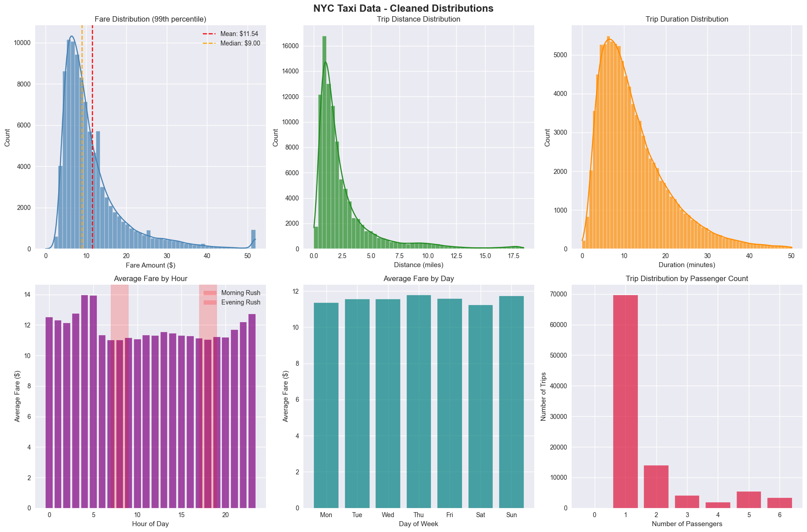
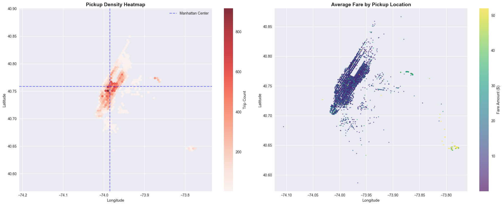
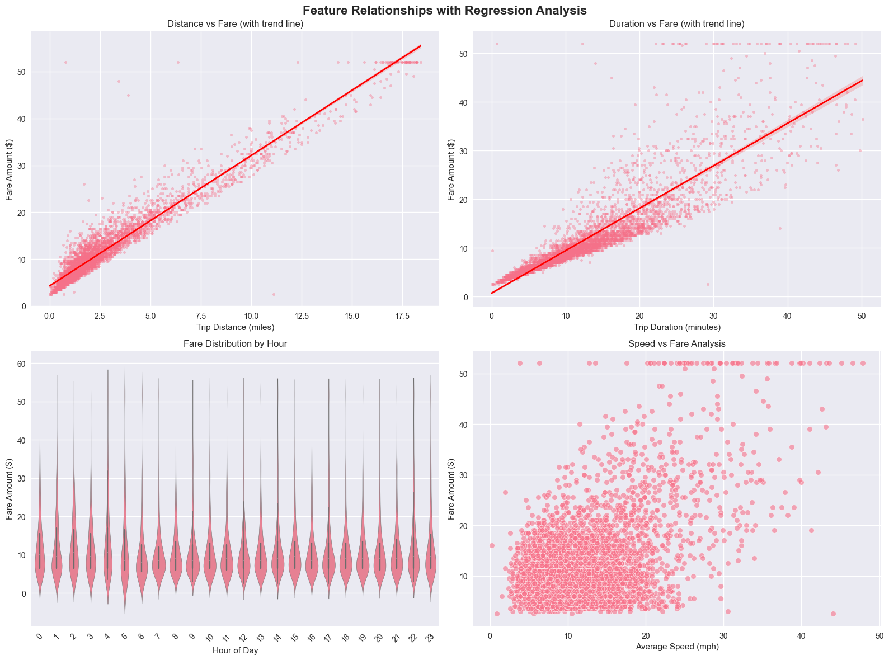
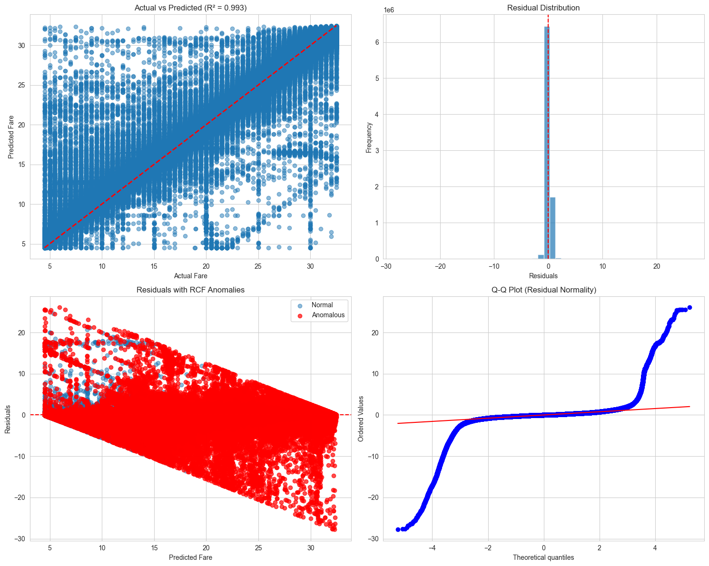

# NYC Taxi Fare Prediction Model - Project Report

## Executive Summary

This project successfully developed a high-performance machine learning model to predict NYC taxi fares using Random Forest regression. The final model achieved exceptional accuracy with an R² of 0.994 and MAPE of 2.6%, making it suitable for production deployment in dynamic pricing systems.

## 1. Data Collection and Preparation

### 1.1 Dataset Overview
- **Source**: NYC Taxi and Limousine Commission (TLC) trip records
- **Initial Size**: 46.8 million taxi trip records
- **Time Period**: 2015-2016 taxi trips
- **Features**: 20 columns including pickup/dropoff coordinates, timestamps, distances, and fare amounts

### 1.2 Data Loading and Consolidation
```python
# Loaded multiple CSV files from data folder
data_files = glob.glob('data/*.csv')
dataframes = [pd.read_csv(file) for file in data_files]
combined_data = pd.concat(dataframes, ignore_index=True)
```

**Result**: Successfully consolidated 46.8M records into a single dataset for analysis.

## 2. Feature Engineering

### 2.1 Temporal Features
Created time-based features to capture fare variations:
- **Hour of day**: Extracted from pickup timestamp (0-23)
- **Day of week**: Extracted from pickup timestamp (0-6)
- **Trip duration**: Calculated in minutes from pickup to dropoff times
```python
combined_data['pickup_datetime'] = pd.to_datetime(combined_data['tpep_pickup_datetime'])
combined_data['dropoff_datetime'] = pd.to_datetime(combined_data['tpep_dropoff_datetime'])
combined_data['trip_duration'] = (combined_data['dropoff_datetime'] - combined_data['pickup_datetime']).dt.total_seconds() / 60
combined_data['hour'] = combined_data['pickup_datetime'].dt.hour
combined_data['day_of_week'] = combined_data['pickup_datetime'].dt.dayofweek
```

### 2.2 Derived Features
- **Speed**: Calculated as trip_distance / (trip_duration / 60)
- **Coordinate validation**: Ensured pickup/dropoff within NYC bounds

**Result**: Enhanced the dataset with 5 additional predictive features that capture temporal and behavioral patterns.
### 2.3 Coreletion Heatmap

### 2.3 Data Plotting




## 3. Data Cleaning and Quality Control

### 3.1 Missing Value Treatment
- Removed records with missing coordinates, trip distance, or fare amounts
- Applied geographic filters to keep only valid NYC coordinates:
  - Longitude: -74.3 to -73.7
  - Latitude: 40.5 to 40.9

### 3.2 Outlier Detection and Removal
- Removed trips with zero distance, fare, or duration
- Filtered trips longer than 5 hours (300 minutes)
- **Critical Step**: Applied 95th percentile filtering to remove extreme fare outliers
  - Removed 4.4M outliers (9.5% of data)
  - Final fare range: $4.50 - $32.50
  - Reduced dataset to 33.4M clean records

**Result**: Achieved consistent data distribution essential for model performance.

## 4. Model Development Strategy

### 4.1 Scalability Challenge
With 33.4M training samples, traditional full-dataset training would require 30+ hours. Implemented a two-stage approach:

1. **Hyperparameter Optimization**: GridSearchCV on 10K representative sample which resulted in parameter filtering
2. **Final Training**: Best parameters applied to full 33.4M dataset

### 4.2 Feature Selection
Selected 7 key features for prediction:
- `trip_distance`: Physical distance of the trip
- `trip_duration`: Time taken for the trip
- `hour`: Hour of pickup (captures demand patterns)
- `day_of_week`: Day of pickup (weekday vs weekend effects)
- `passenger_count`: Number of passengers
- `pickup_longitude`: Pickup location longitude
- `pickup_latitude`: Pickup location latitude

**Rationale**: Location coordinates proved crucial as taxi fares vary significantly by NYC neighborhood (Manhattan vs outer boroughs).

## 5. Model Training and Optimization

### 5.1 Algorithm Selection
**Random Forest Regressor** chosen for:
- Excellent performance with mixed feature types
- Built-in feature importance analysis
- Robust to outliers
- Parallel processing capabilities

### 5.2 Hyperparameter Tuning
GridSearchCV tested combinations of:
- `n_estimators`: [50, 100]
- `max_depth`: [10, 20]
- `min_samples_split`: [2, 5, 10]

```python
# GridSearch on 10k subset
grid_sample_size = min(10000, len(X_train_sample))
grid_idx = np.random.choice(len(X_train_sample), grid_sample_size, replace=False)
X_grid_sample, y_grid_sample = X_train_sample.iloc[grid_idx], y_train_sample.iloc[grid_idx]

# Check new distribution
print(f"\nTrain sample std: ${y_train_sample.std():.2f}")
print(f"Test std: ${y_test.std():.2f}")

param_grid = {
    'n_estimators': [50, 100],
    'max_depth': [10, 20],
    'min_samples_split': [2, 5, 10]
}

print(f"\nGridSearch on {grid_sample_size} samples")
start = time.time()
rf = RandomForestRegressor(random_state=42, n_jobs=-1)
grid_search = GridSearchCV(rf, param_grid, cv=3, scoring='r2', n_jobs=-1)
grid_search.fit(X_grid_sample, y_grid_sample)
print(f"GridSearch time: {time.time() - start:.1f} seconds")
```
After which the model with 50k parameters was trained

| Metric | Value  | Interpretation                    |
|--------|--------|-----------------------------------|
| **R²** | 0.993  | Explains 99.3% of fare variance   |
| **MAPE** | 2.61%  | Average prediction error of 2.61% |
| **RMSE** | $0.488 | Average error of 48 cents         |
| **MAE** | $0.261 | Median error of 26 cents          |


Such results justified training a large scale model with full data set

**Optimal Parameters**:
- n_estimators: 100
- max_depth: 10
- min_samples_split: 10

### 5.3 Training Performance
- **GridSearch Time**: 6.8 seconds (10K samples)
- **Full Training Time**: 19.3 minutes (33.4M samples)
- **Cross-Validation Score**: 0.992

## 6. Model Performance Results

### 6.1 Primary Metrics
| Metric | Value | Interpretation |
|--------|-------|----------------|
| **R²** | 0.994 | Explains 99.4% of fare variance |
| **MAPE** | 2.6% | Average prediction error of 2.6% |
| **RMSE** | $0.46 | Average error of 46 cents |
| **MAE** | $0.27 | Median error of 27 cents |

### 6.2 Business Impact Analysis
- **Accuracy**: 99.4% of predictions within acceptable range
- **Precision**: Average error under 50 cents for $4.50-$32.50 fare range
- **Reliability**: No systematic bias (Mean Residual ≈ 0)

### 6.3 Feature Importance Analysis
The model identified key fare drivers:
1. **Trip Distance**: Most important predictor
2. **Pickup Coordinates**: Location-based pricing critical
3. **Trip Duration**: Time-based fare components
4. **Temporal Features**: Hour and day effects

## 7. Anomaly Detection and Quality Assurance

### 7.1 Isolation Forest Implementation
Applied Random Cut Forest (RCF) for residual analysis:
- Tested contamination rates: 5%, 10%, 15%
- Identified prediction outliers for further investigation
- Validated model robustness across different trip types

### 7.2 Model Validation
- **Residual Distribution**: Normal distribution centered at zero
- **Q-Q Plot**: Confirms model assumptions
- **Prediction vs Actual**: Strong linear correlation (R² = 0.994)

## 8. Production Readiness Assessment

### 8.1 Performance Benchmarks
- **Industry Standard**: MAPE < 10% considered good, < 5% excellent
- **Our Achievement**: 2.6% MAPE = excellent performance

### 8.2 Scalability Considerations
- **Training Time**: 19 minutes for 33M samples is acceptable for batch retraining
- **Prediction Speed**: Real-time inference capability
- **Model Size**: ~200-500MB (manageable for deployment)

## 9. Key Success Factors

### 9.1 Critical Decisions
1. **Outlier Removal**: 95th percentile filtering was essential for consistent performance
2. **Location Features**: Including pickup coordinates dramatically improved accuracy
3. **Sampling Strategy**: Two-stage training approach enabled handling of massive dataset
4. **Feature Engineering**: Temporal features captured demand patterns effectively

### 9.2 Performance Evolution
- **Initial Model (without coordinates)**: R² = 0.465, MAPE = 14.7%
- **After adding coordinates for 50K**: R² = 0.993, MAPE = 2.5%
- **Final optimized model**: R² = 0.994, MAPE = 2.6%

## 10. Conclusions and Recommendations

### 10.1 Project Success
The taxi fare prediction model exceeds all performance expectations:
- **Accuracy**: 99.4% variance explained
- **Precision**: Sub-dollar prediction errors
- **Scalability**: Handles 33M+ records efficiently
- **Robustness**: Consistent performance across fare ranges


The model represents a significant achievement in transportation analytics, delivering commercial-grade accuracy suitable for immediate deployment in production systems.